# COBOL 知识图谱问答系统流程图

## 系统架构流程图（Mermaid）

```mermaid
flowchart TD
    %% ─── 数据源层 ───
    A["📁 数据源采集\n关键点 1️⃣\n─────────────\nCOBOL 源文件仓库\nCopybook 目录\n技术文档 / JCL\nPR / Issue（可选）"]

    %% ─── 解析层 ───
    B["🔍 解析 / 分析层\n关键点 2️⃣\n─────────────\nProLeap ANTLR-based Parser\n（CobolParser / CobolLexer）\n生成 AST + 结构树\n识别 Division / Section / Paragraph"]

    %% ─── 实体抽取 ───
    C["🧩 实体抽取\n关键点 3️⃣\n─────────────\nProgram\nDivision / Section / Paragraph\nCopybook\nDataItem（01/77/88 level）\nFile（FD/SD）\nSQL 引用（EXEC SQL）\nCICS 引用（EXEC CICS）"]

    %% ─── 关系抽取 ───
    D["🔗 关系抽取\n关键点 4️⃣\n─────────────\nCONTAINS（结构包含）\nDEFINES（数据项定义）\nCALLS（程序调用）\nCOPIES（COPY 语句引用）\nUSES_DATA_ITEM（引用数据项）\nREADS_FILE / WRITES_FILE\nSQL_TABLE_ACCESS（SELECT/INSERT/UPDATE/DELETE）"]

    %% ─── 规范化 & ID ───
    E["🔑 规范化 & ID 策略\n关键点 5️⃣\n─────────────\n确定性 ID 生成\n repo + path + symbol 哈希\n实体去重 / Copybook 合并\n标准化名称大小写"]

    %% ─── 验证 ───
    F{"✅ 验证阶段\n关键点 6️⃣\n─────────────\nSchema 合规检查\n悬挂关系检查\n置信度标注\n来源文件标注"}

    F_OK["通过"]
    F_ERR["❌ 错误 → 告警日志\n（保留 / 修复 / 跳过）"]

    %% ─── 导出 ───
    G["📤 导出格式阶段\n关键点 7️⃣\n─────────────\nentities.jsonl（每行一个实体）\nrelations.jsonl（每行一条关系）\nnodes.csv（Neo4j import 格式）\nrelations.csv（Neo4j import 格式）"]

    %% ─── 图加载 ───
    H["🗄️ 图数据库加载\n关键点 8️⃣\n─────────────\nneo4j-admin import\n（nodes.csv / relations.csv）\n或 MERGE via neo4j driver\n增量 MERGE 去重"]

    %% ─── 向量索引 ───
    I["🧲 向量索引构建\n（并行）\n─────────────\nProgram / Paragraph 摘要\nCopybook 说明\n文档 chunk\n存入 Qdrant / pgvector"]

    %% ─── 检索 & QA ───
    J["🤖 检索 & QA 阶段\n关键点 9️⃣\n─────────────\nGraph 检索（Cypher）\nVector 检索（语义）\nRerank（cross-encoder）\nLLM 生成答案 + 证据返回"]

    %% ─── MCP 服务 ───
    K["🛠️ MCP Tool 服务层\n关键点 🔟\n─────────────\nsearch_program(name)\nfind_copybook_usages(name)\ntrace_call_path(from, to)\nget_data_item_def(name)\nquery_sql_table_access(table)\nsearch_code_semantic(query)\nquery_graph(cypher)"]

    %% ─── 增量更新 ───
    L["♻️ 增量更新管道\n关键点 1️⃣1️⃣\n─────────────\nGit Webhook / 定时扫描\n变更文件 diff 检测\n只重解析受影响程序\n更新图节点/边 + 向量索引"]

    %% ─── 连接 ───
    A --> B
    B --> C
    C --> D
    D --> E
    E --> F
    F --> F_OK
    F --> F_ERR
    F_ERR --> E
    F_OK --> G
    G --> H
    G --> I
    H --> J
    I --> J
    J --> K
    L -->|"变更触发\n重新解析"| B
    L -->|"增量 MERGE"| H
    L -->|"向量更新"| I

    %% ─── 样式 ───
    style A fill:#d4edda,stroke:#28a745,color:#000
    style B fill:#cce5ff,stroke:#004085,color:#000
    style C fill:#fff3cd,stroke:#856404,color:#000
    style D fill:#fff3cd,stroke:#856404,color:#000
    style E fill:#f8d7da,stroke:#721c24,color:#000
    style F fill:#e2e3e5,stroke:#383d41,color:#000
    style F_OK fill:#d4edda,stroke:#28a745,color:#000
    style F_ERR fill:#f8d7da,stroke:#721c24,color:#000
    style G fill:#d1ecf1,stroke:#0c5460,color:#000
    style H fill:#d1ecf1,stroke:#0c5460,color:#000
    style I fill:#d1ecf1,stroke:#0c5460,color:#000
    style J fill:#e2d9f3,stroke:#6f42c1,color:#000
    style K fill:#fce8b2,stroke:#e65100,color:#000
    style L fill:#f5e6ff,stroke:#7b1fa2,color:#000
```



---

## 关键点说明

| 关键点 | 阶段 | 说明 |
|--------|------|------|
| 1️⃣ 数据源采集 | 输入层 | COBOL 源文件、Copybook、JCL、可选 PR/Issue |
| 2️⃣ 解析/分析 | AST 层 | 使用 ProLeap/ANTLR 解析器生成结构树 |
| 3️⃣ 实体抽取 | 知识层 | 抽取 Program、Division/Section/Paragraph、Copybook、DataItem、File、SQL/CICS 引用 |
| 4️⃣ 关系抽取 | 知识层 | 每条关系独立记录（行式/边式），包含 CONTAINS、CALLS、COPIES 等 |
| 5️⃣ 规范化 & ID | 质控层 | 基于 repo+path+symbol 生成确定性稳定 ID |
| 6️⃣ 验证 | 质控层 | Schema 检查、悬挂关系、置信度与来源标注 |
| 7️⃣ 导出格式 | 输出层 | entities/relations JSONL + nodes/relations CSV（Neo4j import 兼容） |
| 8️⃣ 图加载 | 存储层 | neo4j-admin import 或 MERGE via driver，支持增量 |
| 9️⃣ 检索 & QA | 服务层 | Graph + Vector + Rerank + LLM 生成答案 |
| 🔟 MCP 服务 | 对外层 | 为 AI Agent 暴露精细工具接口 |
| 1️⃣1️⃣ 增量更新 | 运维层 | 变更触发重解析，MERGE 更新图与向量，保持持续同步 |

---

## 导出格式示例

### entities.jsonl（每行一个实体）

```jsonl
{"id":"prog:ORDPROC","type":"Program","name":"ORDPROC","path":"src/ORDPROC.cbl","repo":"cobol-core","source_file":"src/ORDPROC.cbl"}
{"id":"copy:CUSTMAST","type":"Copybook","name":"CUSTMAST","path":"copybook/CUSTMAST.cpy","repo":"cobol-core"}
{"id":"di:ORDPROC:WS-ORDER-ID","type":"DataItem","name":"WS-ORDER-ID","level":5,"picture":"9(10)","section":"WORKING-STORAGE","program_id":"prog:ORDPROC"}
```

### relations.jsonl（每行一条关系，行式/边式）

```jsonl
{"from":"prog:ORDPROC","to":"copy:CUSTMAST","type":"COPIES","source_file":"src/ORDPROC.cbl","line":12}
{"from":"prog:ORDPROC","to":"prog:VALIDSUB","type":"CALLS","source_file":"src/ORDPROC.cbl","line":87}
{"from":"prog:ORDPROC","to":"di:ORDPROC:WS-ORDER-ID","type":"USES_DATA_ITEM","context":"MOVE","line":103}
{"from":"prog:ORDPROC","to":"tbl:ORDERS","type":"SQL_TABLE_ACCESS","operation":"INSERT","source_file":"src/ORDPROC.cbl","line":210}
```

### nodes.csv（Neo4j import 格式）

```csv
id:ID,name,type:LABEL,path,repo
prog:ORDPROC,ORDPROC,Program,src/ORDPROC.cbl,cobol-core
copy:CUSTMAST,CUSTMAST,Copybook,copybook/CUSTMAST.cpy,cobol-core
```

### relations.csv（Neo4j import 格式）

```csv
:START_ID,:END_ID,:TYPE,source_file,line:int
prog:ORDPROC,copy:CUSTMAST,COPIES,src/ORDPROC.cbl,12
prog:ORDPROC,prog:VALIDSUB,CALLS,src/ORDPROC.cbl,87
```

---

## 实施里程碑清单

### Phase 1 — 解析基础（第 1-2 周）
- [ ] 集成 ProLeap CobolParser（ANTLR-based）
- [ ] 实现 Program / Division / Section / Paragraph 实体抽取
- [ ] 实现 Copybook（COPY 语句）关系抽取
- [ ] 输出 entities.jsonl / relations.jsonl

### Phase 2 — 数据项与文件（第 3-4 周）
- [ ] 实现 DataItem（01/77/88 level）抽取，含 PICTURE / USAGE
- [ ] 实现 File（FD/SD）实体抽取
- [ ] 实现 READS_FILE / WRITES_FILE 关系
- [ ] 实现确定性 ID 生成策略

### Phase 3 — SQL/CICS 与验证（第 5-6 周）
- [ ] 实现 EXEC SQL 解析 → SQL_TABLE_ACCESS 关系（含 DML 操作类型）
- [ ] 实现 EXEC CICS 引用实体抽取
- [ ] 实现验证阶段（Schema 检查 / 悬挂关系检查 / 置信度标注）
- [ ] 导出 nodes.csv / relations.csv（Neo4j import 格式）

### Phase 4 — 图加载与检索（第 7-8 周）
- [ ] neo4j-admin import 批量加载 / MERGE 增量加载
- [ ] 构建向量索引（Program / Paragraph 摘要 → Qdrant）
- [ ] 实现 Graph + Vector 混合检索
- [ ] 实现 Rerank + LLM 问答（附证据返回）

### Phase 5 — MCP 服务与增量更新（第 9-10 周）
- [ ] 实现 MCP Tool 层（search_program / trace_call_path / query_sql_table_access 等）
- [ ] 实现 Git 变更检测 → 增量重解析管道
- [ ] 增量 MERGE 更新图数据库与向量索引
- [ ] 端到端集成测试与文档完善

---

## 技术栈速查

| 层次 | 推荐工具 |
|------|---------|
| COBOL 解析 | [ProLeap ANTLR4 COBOL Parser](https://github.com/uwol/proleap-cobol-parser) |
| 图数据库 | Neo4j（`neo4j-admin import` / `neo4j` Python driver） |
| 向量数据库 | Qdrant / pgvector |
| 检索编排 | LangGraph + LlamaIndex |
| 任务调度 | Dagster / Airflow |
| MCP 服务 | MCP Python SDK / FastMCP |
| 服务接口 | FastAPI |
