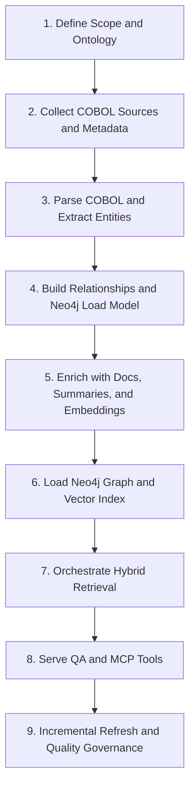

# COBOL Knowledge Graph + QA System Flowchart

## 1. Define Scope and Ontology

**Step overview**  
Define the knowledge model before parsing code so COBOL programs, copybooks, JCL, DB objects, and operational concepts map into a stable graph schema.

**Inputs**  
- Target repositories or mainframe source exports  
- COBOL scope (batch, online, CICS, DB2, VSAM, JCL)  
- Naming conventions and system/domain boundaries  
- Initial QA use cases and MCP tool requirements

**Outputs**  
- Entity model: `Program`, `Paragraph`, `Section`, `Copybook`, `Job`, `Transaction`, `Table`, `File`, `Field`, `Interface`, `Document`  
- Relationship model: `CALLS`, `INCLUDES`, `READS`, `WRITES`, `USES_TABLE`, `TRIGGERS_JOB`, `DOCUMENTED_BY`, `BELONGS_TO`  
- Property conventions for Neo4j node labels and relationship types  
- Query use-case list to drive later indexing decisions

**Suggested tools/frameworks**  
- Neo4j for schema prototyping  
- Draw.io or Mermaid for ontology diagrams  
- JSON/YAML for ontology configuration  
- MCP tool contract draft using official MCP SDK

## 2. Collect COBOL Sources and Metadata

**Step overview**  
Gather all artifacts needed to answer implementation questions, not just `.cbl` files: copybooks, JCL, DB schemas, interface specs, runbooks, and change records.

**Inputs**  
- COBOL source members  
- Copybooks  
- JCL and scheduler definitions  
- DB2 DDL, VSAM/file layouts, MQ/interface specs  
- Existing docs, ticket summaries, and release notes

**Outputs**  
- Normalized source inventory with unique IDs  
- File manifest with system/module ownership  
- Source-to-version mapping for later incremental refresh  
- Raw document store for downstream parsing and summarization

**Suggested tools/frameworks**  
- Python + GitPython for repo/export handling  
- Apache Tika for document text extraction  
- Pandas for manifest normalization  
- Object storage or filesystem staging for raw artifacts

## 3. Parse COBOL and Extract Entities

**Step overview**  
Parse COBOL structure and explicitly extract business and technical entities so the graph is not only relationships between files but also meaningful code elements.

**Inputs**  
- COBOL programs and copybooks  
- Parser configuration for dialect differences  
- Optional metadata for transaction names, job names, and DB mappings

**Outputs**  
- Extracted entities such as programs, sections, paragraphs, copybooks, variables, files, SQL tables, and called subprograms  
- Symbol tables with source location metadata  
- Intermediate parse results in JSON/CSV form for graph ETL  
- Parsing error report for unsupported syntax or dialect gaps

**Suggested tools/frameworks**  
- ANTLR COBOL grammars or ProLeap COBOL parser  
- Python ETL pipeline for parse result transformation  
- Custom regex/rules for embedded SQL, JCL references, and copybook patterns  
- Optional LLM post-processing only for low-confidence enrichment, not core parsing

## 4. Build Relationships and Neo4j Load Model

**Step overview**  
Convert parsed entities into graph-ready nodes and edges, with stable IDs and a load format that Neo4j can ingest reliably.

**Inputs**  
- Extracted entities from parsing  
- Ontology and ID rules  
- Source location metadata and ownership metadata

**Outputs**  
- Node records with labels, IDs, names, types, and source properties  
- Relationship records with start ID, end ID, type, and evidence properties  
- Neo4j import-ready CSV files or Cypher `MERGE` batches  
- Validation checks for duplicate IDs, dangling references, and bad edge types

**Suggested tools/frameworks**  
- Neo4j Admin Import for bulk loads  
- Neo4j Python driver for incremental upserts  
- Pandas for CSV shaping  
- NetworkX for pre-load validation

## 5. Enrich with Docs, Summaries, and Embeddings

**Step overview**  
Add practical context beyond static structure so QA can answer “what does this do” and “where is this business rule implemented.”

**Inputs**  
- Code entities and relationships  
- README/runbook/spec content  
- Change notes, incident notes, and business glossary terms

**Outputs**  
- Program/module summaries linked back to graph nodes  
- Glossary-to-code mappings  
- Chunked documentation and code summaries for vector search  
- Embedding metadata referencing Neo4j node IDs

**Suggested tools/frameworks**  
- LlamaIndex or LangChain for chunking and enrichment pipelines  
- Qdrant or pgvector for embedding storage  
- Sentence Transformers or enterprise embedding models  
- spaCy for glossary/entity normalization

## 6. Load Neo4j Graph and Vector Index

**Step overview**  
Persist the structural graph in Neo4j and the semantic context in a vector index so downstream retrieval can combine both.

**Inputs**  
- Node/relationship load files  
- Enriched summaries and embedding payloads  
- Environment settings for graph and vector stores

**Outputs**  
- Queryable Neo4j database  
- Vector collection keyed by program/module/document chunk  
- Cross-reference fields between vector entries and graph node IDs  
- Initial integrity and performance baseline

**Suggested tools/frameworks**  
- Neo4j Community/Enterprise  
- Qdrant, Milvus, or pgvector  
- Cypher scripts for constraints and indexes  
- Docker Compose for local environment setup

## 7. Orchestrate Hybrid Retrieval

**Step overview**  
Route each user question through the right mix of graph traversal, keyword search, and semantic retrieval.

**Inputs**  
- User question  
- Neo4j graph  
- Vector index  
- Search heuristics and prompt templates

**Outputs**  
- Ranked evidence set: graph paths, code entities, doc chunks, and summaries  
- Context package for answer generation  
- Retrieval trace for debugging and evaluation  
- Query classification such as lineage, dependency, impact, or business-rule lookup

**Suggested tools/frameworks**  
- LangGraph for retrieval orchestration  
- Neo4j Cypher for graph traversal  
- BM25/OpenSearch for lexical recall if needed  
- Cross-encoder rerankers for final evidence ordering

## 8. Serve QA and MCP Tools

**Step overview**  
Expose focused APIs and MCP tools so humans and AI agents can query the COBOL knowledge base without dumping the whole graph into prompts.

**Inputs**  
- Retrieval pipeline  
- MCP tool definitions  
- QA prompt templates and answer formatting rules

**Outputs**  
- QA endpoints with evidence-backed answers  
- MCP tools such as `search_program`, `find_callers`, `trace_job_flow`, `get_table_usage`, and `query_graph`  
- Structured answer payloads with source paths and graph IDs  
- Access pattern logs for tool improvement

**Suggested tools/frameworks**  
- FastAPI or NestJS for service APIs  
- Official MCP Python or TypeScript SDK  
- Pydantic for request/response schemas  
- Neo4j driver and vector DB SDKs for backend integration

## 9. Incremental Refresh and Quality Governance

**Step overview**  
Keep the system current by reprocessing only changed sources and continuously checking graph quality and answer quality.

**Inputs**  
- Changed source lists from Git/export jobs  
- Parser/load job metrics  
- QA feedback and failed query cases

**Outputs**  
- Incremental graph and vector updates  
- Recomputed summaries for impacted programs/modules  
- Quality dashboard for parse coverage, graph integrity, and answer usefulness  
- Backlog of parser/rule improvements

**Suggested tools/frameworks**  
- Dagster or Airflow for scheduled refresh  
- Celery/RQ for asynchronous jobs  
- Neo4j APOC for maintenance tasks  
- MLflow or simple evaluation scripts for QA quality tracking
